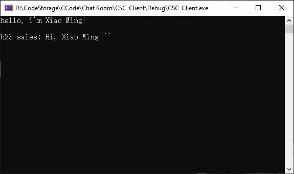

## 一些demo
[一、哈夫曼树编码器 Demo 地址](HuffmanTree/Release)  
[二、扫雷游戏 Demo 地址](Bombsweep/Release)  
[三、控制台端对端聊天室(烂尾 &<) Demo 地址](ChatRoom)  

---
## 一、哈夫曼树编码器Demo
### 0. Note
输入的译码不是原编码串会闪退

### 1. 功能演示
输入任一字符串如"apple"会进行编码，输入编码串进行译码还原出"apple"  

  

---
## 二、扫雷Demo
### 0. Note
难度中等/困难解锁30 bombs左右有bug仍未解决  
另外在游戏开始之后，频繁拖动边框也会出现bug

### 1. 界面设计
难度分为简单(10 bombs)、中等(40 bombs)和困难(100 bombs)  

  

  

  
支持界面边界拖动，其内元素会自适应变化  

  

### 2. 其他设计
第一次点击不出现bomb。另外在点击到空白块的同时会暴露周围所有的空白块  

  
点击到bomb时..  

  

---
## 三、控制台端对端聊天室Demo ( &< )
### 0. Note
已完成聊天功能，传输(图片、文字)功能；断点续传只支持txt文本，聊天记录保存边界检测还存在bug ;-<
需要在E盘新建一个SYSTEM文件夹才能启动(保存注册数据、保存用户聊天记录等等)，文件夹结构： 

├─ Client  
│   ├─ Record_Saved  
│   └─ recv  
└─ Server  
    ├─ FileTrans  
    ├─ Piece  
    │─ Record  
    └─ UserData  

### 1. 功能演示
用户1与用户2的聊天消息是通过服务器中转实现的。    

  

  
